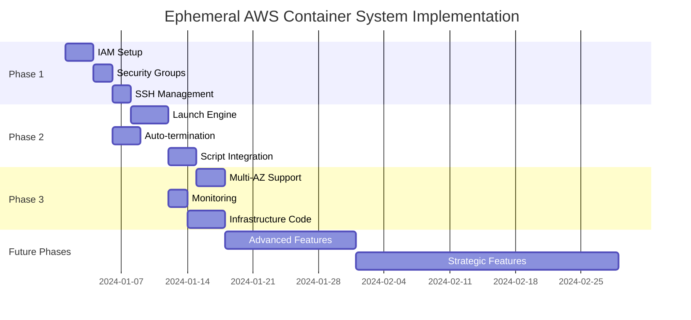

# Ephemeral AWS Container System - Implementation Roadmap

## Overview

This roadmap outlines the phased implementation strategy for the Ephemeral AWS Container System, prioritized by risk mitigation, cost control, and value delivery. The roadmap is designed to achieve operational capability within 2-4 weeks while building toward a mature, scalable infrastructure solution.

## Phase Prioritization Framework

### Risk-Priority Matrix
```
P0 (Critical): Direct impact on cost, security, or basic functionality
P1 (High): Operational efficiency and reliability improvements
P2 (Medium): Enhanced features and user experience
P3 (Low): Advanced features and optimizations
P4-P5 (Future): Long-term strategic capabilities
```

### Success Criteria per Phase
- **Phase Completion**: All P0 items delivered and validated
- **Quality Gate**: Security scan passed, cost controls verified
- **Handoff**: Documentation complete for next phase team

## Phase 1: Foundation Infrastructure (P0) - Week 1-2

### **Primary Objective**: Establish secure, cost-controlled AWS infrastructure foundation

### Core Deliverables

#### 1.1 AWS Identity and Access Management (P0)
**Duration**: 2-3 days | **Owner**: AWS Expert + Security Architect

**Deliverables**:
```yaml
IAM Role Configuration:
  - Role Name: SystemAdminTestingRole
  - Trust Policy: EC2 service assume role
  - Attached Policies: 
    - Custom policy: EC2 spot management
    - AWS managed: CloudWatchLogsFullAccess (scoped)
  - Validation: Role assumption test from EC2

IAM Policy Definition:
  - EC2 Permissions: RunInstances, TerminateInstances, DescribeInstances
  - Spot Permissions: RequestSpotInstances, CancelSpotInstanceRequests
  - Security Group: Authorize/RevokeSecurityGroupIngress
  - CloudWatch: PutMetricData, CreateLogGroup, PutLogEvents
  - Cost Control: MaxSpotPrice enforcement
```

**Success Criteria**:
- [ ] IAM role created with least privilege access
- [ ] Policy validation through AWS IAM Access Analyzer
- [ ] Role assumption tested from EC2 instance
- [ ] Cost impact: $0.00/month (IAM is free tier)

#### 1.2 Security Group Management (P0)
**Duration**: 1-2 days | **Owner**: Security Architect + Implementation Specialist

**Deliverables**:
```yaml
Security Group Design:
  - Name: ephemeral-admin-sg
  - Description: Dynamic SSH access for ephemeral containers
  - Inbound Rules: SSH (22) from 0.0.0.0/0 (initially)
  - Outbound Rules: All traffic (required for package updates)
  - Tags: Project=EphemeralContainer, AutoManaged=true

Dynamic IP Management:
  - IP Detection: External IP resolution via ipify.org
  - Rule Updates: AWS CLI security group modifications
  - Cleanup Logic: Remove IP rules on session termination
  - Error Handling: Graceful fallback to manual IP specification
```

**Success Criteria**:
- [ ] Security group created with proper tags
- [ ] Dynamic IP detection working across network configurations
- [ ] IP rule addition/removal tested
- [ ] Cleanup logic verified on termination scenarios

#### 1.3 SSH Key Management (P0)
**Duration**: 1-2 days | **Owner**: Security Architect + Implementation Specialist

**Deliverables**:
```yaml
Key Generation Strategy:
  - Algorithm: RSA-4096 or Ed25519
  - Storage: Temporary local storage only
  - Distribution: EC2 user-data script
  - Cleanup: Private key deletion on session end
  - Backup: No persistent backup (security requirement)

Implementation Components:
  - Key generation script: generate_ephemeral_keys.sh
  - User-data template: install_ssh_key.sh
  - Cleanup handler: cleanup_keys.sh
  - Validation: Key-based SSH connection test
```

**Success Criteria**:
- [ ] Ephemeral key generation working
- [ ] Public key installation via user-data
- [ ] SSH connection established with generated keys
- [ ] Private key cleanup verified

### Phase 1 Integration Testing

**Integration Test Suite**:
1. **End-to-End Launch Test**: Complete launch sequence with all components
2. **Security Validation**: Penetration testing of SSH access
3. **Cost Validation**: Confirm zero-cost infrastructure setup
4. **Error Handling**: Test failure scenarios and rollback procedures

**Phase 1 Success Gate**:
- [ ] All P0 deliverables completed and tested
- [ ] Security scan passed (no critical vulnerabilities)
- [ ] Cost impact confirmed at $0.00/month (infrastructure only)
- [ ] Documentation complete for Phase 2 handoff

---

## Phase 2: Core Launch Functionality (P1) - Week 2-3

### **Primary Objective**: Implement automated EC2 spot instance launch and SSH connectivity

### Core Deliverables

#### 2.1 Spot Instance Launch Engine (P1)
**Duration**: 3-4 days | **Owner**: AWS Expert + Implementation Specialist

**Deliverables**:
```yaml
Launch Script Components:
  - Prerequisites validation: check_prerequisites.sh
  - Spot instance request: launch_spot_instance.sh
  - Instance readiness monitoring: wait_for_ready.sh
  - SSH connection establishment: connect_ssh.sh
  - Error handling and rollback: cleanup_failed_launch.sh

Spot Instance Configuration:
  - Instance Type: t3.small (primary), t3.micro (fallback)
  - AMI Selection: Latest Ubuntu 20.04 LTS
  - Spot Price Limit: 50% of on-demand pricing
  - User Data: SSH key installation + basic system setup
  - Instance Metadata: Required tags for cost tracking
```

**Success Criteria**:
- [ ] Reliable spot instance launch (<90 seconds)
- [ ] Automatic fallback to on-demand if spot unavailable
- [ ] SSH connectivity established within 60 seconds
- [ ] Proper instance tagging for cost allocation

#### 2.2 Auto-Termination Mechanisms (P1)
**Duration**: 2-3 days | **Owner**: AWS Expert + Security Architect

**Deliverables**:
```yaml
Multi-Layer Termination:
  1. SSH Session Monitor:
     - systemd service monitoring SSH connections
     - Triggers on connection close/timeout
     - Grace period: 2 minutes before termination
  
  2. CloudWatch Integration:
     - Network metrics monitoring (NetworkIn/Out)
     - Alarm threshold: <50 bytes/min for 5 minutes
     - Action: SNS notification + instance termination
  
  3. Maximum Runtime Protection:
     - Hard limit: 4 hours per session
     - Implementation: cron job + self-termination
     - Override capability: extend session command

Cost Control Integration:
  - Budget alerts at $1.00 monthly threshold
  - Instance hour tracking and reporting
  - Automatic termination on cost limit approach
```

**Success Criteria**:
- [ ] SSH disconnection triggers termination within 2 minutes
- [ ] Maximum runtime enforcement working
- [ ] CloudWatch alarms properly configured
- [ ] Cost tracking and alerts functional

#### 2.3 Main Launch Script Integration (P1)
**Duration**: 2-3 days | **Owner**: Implementation Specialist

**Deliverables**:
```bash
# launch-admin.sh - Main orchestration script
Key Features:
  - Single command execution: ./launch-admin.sh
  - Prerequisites check and validation
  - Dynamic IP detection and security group update
  - Spot instance launch with error handling
  - SSH connection with key management
  - Auto-cleanup on exit/failure
  - Comprehensive logging and error reporting

Configuration Management:
  - Config file: ~/.ephemeral-admin/config
  - AWS region and instance preferences
  - Session timeout and retry settings
  - Cost alert thresholds
```

**Success Criteria**:
- [ ] Single command launch working end-to-end
- [ ] Comprehensive error handling and user feedback
- [ ] Session logging for troubleshooting
- [ ] Clean termination on script exit

### Phase 2 Integration Testing

**Test Scenarios**:
1. **Normal Operation**: Standard launch → connect → work → disconnect → terminate
2. **Failure Recovery**: Network issues, spot unavailability, SSH failures
3. **Cost Validation**: Session cost calculation and reporting
4. **Security Testing**: Unauthorized access attempts, key security

**Phase 2 Success Gate**:
- [ ] Complete launch-to-termination workflow functional
- [ ] Cost target achieved (<$0.33 per session)
- [ ] Security requirements validated
- [ ] User experience meets 60-second connection target

---

## Phase 3: Resilience and Optimization (P2) - Week 3-4

### **Primary Objective**: Implement multi-AZ resilience, enhanced monitoring, and cost optimization

### Core Deliverables

#### 3.1 Multi-AZ Failover (P2)
**Duration**: 2-3 days | **Owner**: AWS Expert + System Architect

**Deliverables**:
```yaml
Availability Zone Strategy:
  - Primary AZ: us-east-1a (lowest cost)
  - Fallback AZs: us-east-1b, us-east-1c, us-east-1d
  - Selection Logic: Spot pricing comparison
  - Failure Detection: Launch timeout or capacity issues

Implementation:
  - AZ selection algorithm based on spot pricing
  - Automatic retry logic with AZ rotation
  - Health check validation post-launch
  - Performance metrics collection per AZ
```

**Success Criteria**:
- [ ] Automatic AZ failover on capacity issues
- [ ] Cost optimization through AZ selection
- [ ] 99% launch success rate across all scenarios
- [ ] AZ performance metrics collection

#### 3.2 Enhanced Logging and Monitoring (P2)
**Duration**: 2 days | **Owner**: AWS Expert + Implementation Specialist

**Deliverables**:
```yaml
CloudWatch Integration:
  - Custom Metrics: Session duration, cost per session
  - Log Groups: /aws/ephemeral-container/{instance-id}
  - Dashboards: Real-time session monitoring
  - Alerts: Cost threshold warnings, security events

Session Analytics:
  - Launch success/failure rates
  - Average connection times
  - Cost trends and optimization opportunities
  - Security audit trail
```

**Success Criteria**:
- [ ] Comprehensive session logging operational
- [ ] Cost analytics dashboard functional
- [ ] Security audit trail implementation
- [ ] Performance metrics trending

#### 3.3 Infrastructure as Code Foundation (P2)
**Duration**: 3-4 days | **Owner**: IaC Developer + System Architect

**Deliverables**:
```yaml
Terraform Configuration:
  - VPC and networking (optional, use default VPC initially)
  - IAM roles and policies as code
  - Security groups with version control
  - Launch templates for consistent configuration

Benefits:
  - Infrastructure versioning and rollback
  - Multi-environment support (dev/prod)
  - Team collaboration on infrastructure changes
  - Automated testing of infrastructure changes
```

**Success Criteria**:
- [ ] Complete infrastructure defined in Terraform
- [ ] State management configured (S3 backend)
- [ ] Infrastructure testing automated
- [ ] Documentation for infrastructure changes

### Phase 3 Integration Testing

**Advanced Test Scenarios**:
1. **Resilience Testing**: AZ failures, network partitions, service limits
2. **Performance Testing**: High-frequency launches, concurrent sessions
3. **Cost Optimization**: Extended usage patterns, different instance types
4. **Security Hardening**: Advanced threat scenarios, compliance validation

---

## Phase 4: Advanced Features and Tooling (P3) - Future Sprints

### **Primary Objective**: Enhanced user experience and operational capabilities

### Planned Deliverables

#### 4.1 Session Management (P3)
- Session persistence across disconnections
- Session sharing capabilities
- Advanced terminal features (tmux integration)
- Session recording and playback

#### 4.2 System Administration Tools (P3)
- Pre-installed system administration toolkit
- Configuration management (Ansible playbook integration)
- Container and Kubernetes tooling
- Cloud CLI tools (AWS, Azure, GCP)

#### 4.3 Cost and Usage Analytics (P3)
- Advanced cost allocation and reporting
- Usage pattern analysis and optimization
- Budget forecasting and recommendations
- ROI analysis vs alternative solutions

---

## Phase 5: Strategic Enhancements (P4-P5) - Long-term

### **Primary Objective**: Strategic capabilities and platform evolution

### Future Capabilities

#### 5.1 Multi-Cloud Support (P4)
- Azure Container Instances integration
- Google Cloud Run alternative
- Cross-cloud cost comparison
- Unified launch interface

#### 5.2 Web Interface (P5)
- Browser-based launch and management
- Team access and sharing
- Web-based terminal interface
- Administrative dashboard

#### 5.3 Enterprise Integration (P5)
- Active Directory/SAML authentication
- Corporate VPN integration
- Compliance reporting automation
- Enterprise cost allocation

---

## Implementation Timeline



## Success Metrics and Milestones

### Key Performance Indicators

**Phase 1 KPIs**:
- Infrastructure setup cost: $0.00/month
- Security configuration time: <1 hour
- IAM policy validation: 100% pass rate

**Phase 2 KPIs**:
- Launch success rate: >95%
- Connection time: <60 seconds
- Session cost: <$0.33 per session

**Phase 3 KPIs**:
- Multi-AZ failover: <90 seconds
- Infrastructure changes: Version controlled
- Monitoring coverage: 100% of sessions

### Risk Mitigation Checkpoints

**Weekly Risk Review**:
- Cost tracking vs $2/month budget
- Security posture assessment
- Technical debt accumulation
- User experience feedback

**Phase Gate Reviews**:
- Stakeholder approval for phase progression
- Technical architecture validation
- Cost model verification
- Security compliance confirmation

## Resource Allocation

### Team Assignment by Phase

**Phase 1 Team** (Week 1-2):
- AWS Expert (40 hours)
- Security Architect (30 hours)
- Implementation Specialist (20 hours)

**Phase 2 Team** (Week 2-3):
- AWS Expert (50 hours)
- Implementation Specialist (40 hours)
- Security Architect (20 hours)

**Phase 3 Team** (Week 3-4):
- IaC Developer (40 hours)
- AWS Expert (30 hours)
- System Architect (20 hours)

### Budget Allocation

**Development Costs**: $0 (using existing AWS credits/free tier)
**Operational Costs**: <$2/month target
**Tooling Costs**: $0 (open source tools only)
**Testing Costs**: <$10 (temporary testing infrastructure)

## Success Criteria Summary

The roadmap is considered successful when:

1. **Core Functionality**: Single command launch to shell access in <60 seconds
2. **Cost Target**: Monthly operational cost consistently <$2.00
3. **Security Posture**: Zero critical vulnerabilities, audit trail complete
4. **Reliability**: >95% launch success rate across all conditions
5. **Maintainability**: Infrastructure as code with version control
6. **Documentation**: Complete operational and troubleshooting guides

This roadmap provides a clear, risk-prioritized path to delivering a production-ready ephemeral container system that meets all strategic objectives while maintaining cost discipline and security best practices.